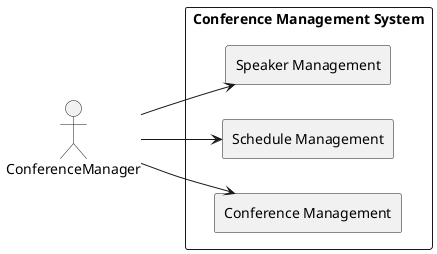

# Описание требований и архитектуры

## Введение
<!-- Общее краткое описание создаваемой системы -->
В рамках курса осуществляется проектирование решения на основе [постановки задачи от "заказчика"](../../task.md).

- [Описание требований и архитектуры](#описание-требований-и-архитектуры)
  - [Введение](#введение)
  - [Заинтересованные стороны](#заинтересованные-стороны)
  - [Бизнес-контекст (бизнес-требования)](#бизнес-контекст-бизнес-требования)
  - [Глоссарий](#глоссарий)
  - [Модель предметной области](#модель-предметной-области)
  - [Требования к системе](#требования-к-системе)
    - [Ключевые бизнес-метрики](#Ключевые-бизнес-метрики)
    - [Функциональные требования](#функциональные-требования)
    - [Нефункциональные требования/Требования к атрибутам качества](#нефункциональные-требованиятребования-к-атрибутам-качества)
    - [Ограничения](#ограничения)
  - [Архитектура](#архитектура)
    - [Журнал архитектурных решений](#журнал-архитектурных-решений)
    - [Контекст решения](#контекст-решения)
    - [Компонентная архитектура](#компонентная-архитектура)
    - [Реализация сценариев использования](#реализация-сценариев-использования)
    - [Программные интерфейсы](#программные-интерфейсы)
    - [Схема развертывания](#схема-развертывания)
  
## Заинтересованные стороны
<!-- Перечень заинтересованных сторон и их интересов по отношению к создаваемой системе. 
Подробнее: https://confluence.mts.ru/pages/viewpage.action?pageId=399975538 
-->
| Заинтересованная сторона | Интересы           |
|:-------------------------|:-------------------|
| Спонсоры                 | Реклама\подажа\распространение в продукте  helloconf.mts.ru, привлечь внимание к своему бренду |
| Спикеры                  | Поделиться своими знаниями и опытом с участниками, подтвердить свои профессиональные качества |
| IT компании              | Продвижение собственного брэнда в контексте докладов своих представителей продукта helloconf.mts.ru|
| Организаторы продукта конференции | Сделать конференцию успешной, обеспечив, чтобы все прошло гладко и чтобы участники получили положительный опыт|
| Участники | Получить знания и идеи от спикеров и других участников, а также установить новые связи, которые могут помочь им в их карьере|

## Бизнес-контекст (бизнес-требования)
<!-- Общее описание бизнес-контекста создаваемой системы (автоматизируемой деятельности), список бизнес-целей заинтересованных сторон 
Подробнее: https://confluence.mts.ru/pages/viewpage.action?pageId=399973845
-->
|                            |
|:--------------------------------------------|
| Отчетность: Конференц-система должна быть способна генерировать отчеты на основе регистрационных данных участников, интересующих тем, отзывов и оценок |
| Обратная связь: Конференц-система должна позволять участникам оставлять отзывы о содержании, представленном во время сеансов конференции, а также об общем качестве конференции |
| Составление программы конференции: Конференц-система должна позволять менеджеру программы создавать и редактировать программу конференции. Это должно включать в себя возможность легко добавлять или удалять сеансы, назначать докладчиков для сеансов и корректировать расписание по мере необходимости |
| Работа со спикерами: Конференц-система должна позволять менеджеру программы легко общаться с спикерами (приглашать, подтверждать и планировать) и управлять деталями их сеанса (содержание, потребности в оборудовании, планировка помещения и т. д.) |
| Планирование: Конференц-система должна управлять планированием сеансов, включая назначение помещений, время начала и окончания, а также любые особые требования к сеансам (например, синхронный перевод, видеоконференции и т. д.) |
| Трансляция. Конференц-система должна иметь возможность транслировать сеансы конференции удаленным участникам посредством прямой трансляции или видеоконференций, а также позволять удаленным участникам участвовать в сеансах вопросов и ответов |
| Сбор отзывов. Конференц-система должна позволять участникам оставлять отзывы о посещенных ими сессиях, а также об общем впечатлении от конференции. Эта обратная связь должна быть собрана и проанализирована, чтобы помочь информировать будущие конференции |

## Глоссарий
<!-- Содержит основные понятия и термины предметной области  
Подробнее: https://confluence.mts.ru/pages/viewpage.action?pageId=375782595
-->
| Понятие                        | Сокращение                         | Определение                       |
|:-------------------------------|:-----------------------------------|:----------------------------------|
| Докладчик | Speaker| Человек, который зарегистрировался для участия в конференции и подал заявку на представление своего доклада  |
|Доклад | Presentation | Работа, которую докладчик представляет на конференции|
|Партнеры |Partner| Лица, cпонсирующие мероприятие или предоставляющие докладчиков |
|Рецензент | Reviewer|Человек, который оценивает доклад и дает обратную связь докладчику|
|Программа конференции | Program | Расписание докладов и мероприятий на конференции|
|Расписание | Conference | Список докладов и мероприятий на конференции, распределенных по времени и месту|
|Аудитория | Audience | Зрители, которые присутствуют на конференции|
|Трансляция | Translation | Передача мероприятия в режиме реального времени через сеть|
|Обратная связь | Feedback | Информация, полученная от аудитории о мероприятии|
|Сессии |Session| Выступление докладчика  |

## [Модель предметной области](data/data.md)

## Требования к системе

### Сценарии использования (Use case)
<!-- Подробное описание сценариев использования системы с привязкой к ролям участников и задействованным бизнес-сущностям 
https://confluence.mts.ru/pages/viewpage.action?pageId=375782108 
https://confluence.mts.ru/pages/viewpage.action?pageId=375782119 
-->
#### Диаграмма сценариев использования (Use Case Diagram) <!-- omit in toc -->

#### Ключевые бизнес-метрики <!-- omit in toc -->

|  Метрика                                          |
|---------------------------------------------------|
|Количество докладчиков, зарегистрированных на конференцию;
|Количество участников конференции;
|Количество заданных вопросов докладчикам;
|Количество докладов, представленных на конференции;
|Время ответа системы на запросы участников конференции.

### Функциональные требования
<!-- Описание требований к функциям, реализуемым системой. Требование может быть привязано к сценарию использования или быть общим 
Подробнее: https://confluence.mts.ru/pages/viewpage.action?pageId=375782501 
-->
| ID     | Функциональное требование             |
|--------|---------------------------------------|
| FR.001 | Программа конферениций должна представлять собой веб-портал, предоставляющий возможность работы в ЛК для роли пользователей и менеджеров |
| FR.002 | Программа конферениций должна поддерживать авторизацию пользователей |
| FR.003 | Программа конферениций должна поддерживать авторизацию пользователей, предоставляя соответствущую роли функциональность |
| FR.004 | Программа конферениций должна реализовать возможность регистрации в системе, загрузки, верификации и проверки докладов на соответствие выбранной темы |
| FR.005 | Программа конферениций должна реализовать формирование докладов в группы тематик и планирование времени выступления для дня конференции, запуск трансляции
| FR.006 | Программа конферениций должна предоставлять инструменты для работы со спикерами, такие как приглашение их к участию в конференции, отправка им напоминаний и инструкций, а также управление их презентациями или выступлениями |
| FR.007 | Программа конферениций должна обеспечивать прямую трансляцию и виртуальное присутствие, позволяя удаленным участникам присоединяться к сеансам конференции и взаимодействовать с выступающими и другими посетителями |
| FR.008 | Программа конферениций должна позволять пользователю просматривать отчеты, представленные участниками, и оставлять отзывы или комментарии|

### Нефункциональные требования/Требования к атрибутам качества
<!-- Требования к основным архитектурным характеристикам (атрибутам качества) системы - надежность, масштабируемость, ИБ, и др.
Подробнее: https://confluence.mts.ru/pages/viewpage.action?pageId=375782530
-->
| ID     | Атрибут качества             | Алгоритм мониторинга |Описание требования                       |
|--------|------------------------------|----------|-------------------------------------------|
| QR.001 | Производительность: время ответа системы должно быть не более 3 секунд | Cистема должна регистрировать время ответа на каждый запрос и оповещать администратора, если это время превышает 3 секунды | Система должна обрабатывать до 500 заявок на доклад в день |
|QR.002|Надежность: система должна иметь резервное копирование данных  | Cистема должна регистрировать время простоя и оповещать администратора, если оно превышает 5 минут|Cистема должна иметь резервное копирование данных. |Cистема должна регистрировать время простоя и оповещать администратора, если оно превышает 5 минут|
|QR.003|Безопасность: система должна использовать протоколы шифрования и иметь механизмы аутентификации пользователей| Система должна регистрировать все попытки несанкционированного доступа и оповещать администратора|Cистема должна защищать персональные данные пользователей|
|QR.004|Масштабируемость: система должна иметь возможность горизонтального масштабирования |Система должна регистрировать количество участников конференции и оповещать администратора, если это количество превышает заданное значение|Cистема должна обеспечивать возможность увеличения количества участников конференции|
|QR.005|Удобство использования: система должна иметь простой и интуитивно понятный интерфейс| Система должна проводить опросы пользователей и оповещать администратора о недостатках интерфейса|Система должна иметь простой и интуитивно понятный интерфейс|

### Ограничения
<!-- Описываются ограничения, оказывающие влияние на архитектуру системы - временные, финансовые, технологические
Подробнее: https://confluence.mts.ru/pages/viewpage.action?pageId=375782592
-->
| ID     | Ограничение            |
|--------|------------------------|
| AC.001 | *Описание ограничения* |

## Архитектура

### Журнал архитектурных решений
<!-- Записи о ключевых принятых архитектурных решениях (ADR) для реализации архитектурно-значимых требований.
Подробнее: https://confluence.mts.ru/pages/viewpage.action?pageId=421162308
-->
- [ADR.001 Выбор категории системы](adr/ADR-001.md)
- [ADR.002 Выбор шаблона интеграции](adr/ADR-002.md)

### [Контекст решения](context/context.md)

### [Компонентная архитектура](components/components.md)

### Реализация сценариев использования
<!-- Реализация сценариев использования на основе взаимодействия компонентов системы и внешних систем/участников.
Диаграммы последовательности (UML Sequence diagram) и текстовое описание.

Подробнее: 
https://confluence.mts.ru/pages/viewpage.action?pageId=399442132
https://confluence.mts.ru/pages/viewpage.action?pageId=399442170
-->
| ID     | Описание                          | Реализация                                    |
|--------|-----------------------------------|-----------------------------------------------|
| UC.001 | *Название сценария использования* | [Реализация сценария](uc-impl/uc.001-impl.md) |

### Программные интерфейсы
<!-- Спецификации публичных API системы и ее компонентов (синхронных, событийных). Создается на основе модели предметной области для реализации сценариев использования. 
  Форматы: OAS/Swagger, GraphQL, AsyncAPI/CloudEvents
-->
| Компонент             | Интерфейс                                      |
|:----------------------|:-----------------------------------------------|
| *Название компонента* | *[Название интерфейса](api/service-name.yaml)* |

### [Схема развертывания](deployment/deployment.md)
